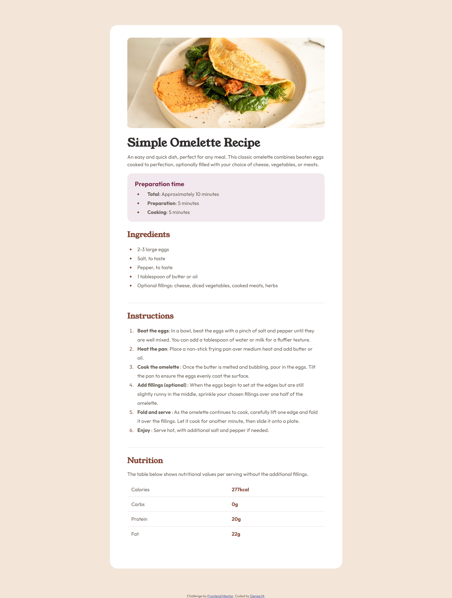

# Frontend Mentor - Recipe page solution

This is a solution to the [Recipe page challenge on Frontend Mentor](https://www.frontendmentor.io/challenges/recipe-page-KiTsR8QQKm). Frontend Mentor challenges help you improve your coding skills by building realistic projects.

## Table of contents

- [Overview](#overview)
  - [The challenge](#the-challenge)
  - [Screenshot](#screenshot)
  - [Links](#links)
- [My process](#my-process)
  - [Built with](#built-with)
  - [What I learned](#what-i-learned)
  - [Continued development](#continued-development)
  - [Useful resources](#useful-resources)
- [Author](#author)
  **Note: Delete this note and update the table of contents based on what sections you keep.**

## Overview

### Screenshot

### Links

- [Solution URL](https://your-solution-url.com)
- [Live Site URL](https://your-live-site-url.com)

## My process

### Built with

- Semantic HTML5 markup
- CSS custom properties
- Flexbox
- Mobile-first workflow

### What I learned

Learned to better utilize reusable code when it came to css. Repeated patterns were given class names that follow BEM rules. This project served as a reminder of how to use table elements, as well as lists. Overall it was a very straight forward build. However, I did come across some challenges trying to replicate the design when it came to list style decoration.

### Continued development

Giving some attention to list styling would be something I plan on looking more into for the future.

### Useful resources

- [List Styling ](https://www.w3schools.com/howto/howto_css_bullet_color.asp) - This helped me styling the bullet points on list
- [Table Styling](https://stackoverflow.com/questions/20872200/giving-a-border-to-an-html-table-row-tr) - This is helped me figure out the stlying for the table element.

## Author

- Frontend Mentor - [@moncadad](https://www.frontendmentor.io/profile/moncadad)
